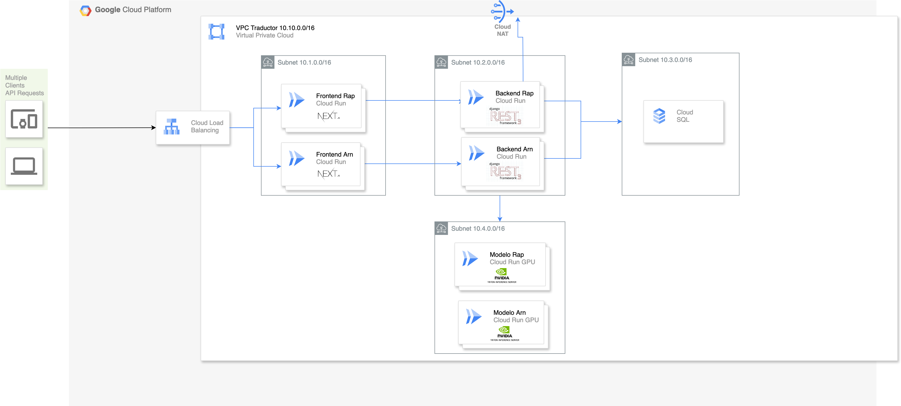

# Translator

## Model Setup

For model setup, we use [Pytriton](https://github.com/triton-inference-server/pytriton) to serve the model. Pytriton is a framework for building and serving models. It's a lightweight framework that allows for easy deployment of models.

Move to the `Model` folder and run `pip install -r requirements.txt` to install the dependencies. Note that pytriton has support only for Ubuntu 22+, Debian 11+, Rocky Linux 9+, and Red Hat UBI 9+ operating systems.

Then start the server. A valid model name is required. The model name can be a path to a folder containing the model or a model name as of huggingface.
In this instructions, we'll use huggingface to download model weights. We'll use the [`CenIA/nllb-200-3.3B-spa-rap`](https://huggingface.co/CenIA/nllb-200-3.3B-spa-rap) model that we developed for this project. You can also use vainilla NLLB models from their [repository](https://huggingface.co/facebook/nllb-200-3.3B).

You can run the server with the following command:

```
python server.py --model-name CenIA/nllb-200-3.3B-spa-rap
```

A few extra options are provided:

- `--port`: The port to use. Default is 8015.
- `--gpu`: If use GPU. Default is False.
- `--optimize`: If use optimizations. Default is False.
- `--num-copies`: The number of copies of the model to use. This allows Pytriton to serve multiple requests in parallel. Default is 1.

Extra configurations were configured to increase the performance of the model, such as Dynamic Batching and response caching.

If all goes well, model server should be listening to requests on port 8015. You can test the server by running `python client.py --model-name CenIA--nllb-200-3.3B-spa-rap --port 8015`. Note the `--` in the model name instead of `/`. Change the port to the one you set in the server. You can also change the source and target languages with `--source-lang` and `--target-lang` and `--text` arguments. Note that currently this model only supports `spa_Latn` and `rap_Latn` languages in both directions.

## Backend Setup

First, create a Postgresql database and store the database name and host in case of using an external service.

Then install the dependencies.  To do so, go to the `Backend/translatorapp_v2` folder and run `pip install -r requirements.txt`.

Django needs a secret key for encription. To create one run: `python -c "from django.core.management.utils import get_random_secret_key; print(get_random_secret_key())"` and copy the output key.

Then, create the superuser. To do so, go to the `Backend/translatorapp_v2` folder and run `python manage.py createsuperuser`. Make sure that the username and email are both set to your email.

Create a file named `.env` inside `Backend/translatorapp_v2`. The file should look something like this:

```
# database configuration
DB_PASSWORD="<database passsword>"
DB_USER="<database user>"
DB_HOST="<database host: localhost in case of running locally, instead external ip>"
DB_PORT="<database port, should be 5432>"
DB_NAME="<database name>"

VARIANT="<arn or rap>"

# For email configurations
EMAIL_USER="<email account for sending emails>"
EMAIL_KEY="<email account key from email_user>"
INVITATION_GUIDE_URL="<link to invitation guide sent in invite email>"
SUPPORT_EMAIL="<support email sent in invite email>"

DJANGO_SUPERUSER_USERNAME="<username from superuser created before>"
DJANGO_SUPERUSER_EMAIL="<email from superuser created before>"
DJANGO_SUPERUSER_PASSWORD="<password from superuser created before>"

PRODUCTION="False"
SECRET_KEY="<Django key created in previous step>"
APP_FRONTEND_URL="http://localhost:3000"

APP_INFERENCE_MODEL_NAME="CenIA--nllb-200-3.3B-spa-rap"
APP_INFERENCE_MODEL_URL="http://localhost:8015"
APP_RAW_INFERENCE_MODEL_NAME="CenIA--nllb-200-3.3B-spa-rap"
APP_RAW_INFERENCE_MODEL_URL="http://localhost:8015"
```

Note that the model name is the one used in the first step. You can change it to your own model name.
Then, run database migrations. To do so, go to the `Backend/translatorapp_v2` folder and run `python manage.py migrate`

## Frontend Setup

Open the `Frontend/translator` and Run `npm i` to install the dependencies

Create a file named `.env` inside `Frontend/translator`. The file should look something like this:

```
NEXT_PUBLIC_API_URL = "http://127.0.0.1:8000"
NEXT_PUBLIC_VARIANT = "<arn or rap>"
# Optional: Control translation access
NEXT_PUBLIC_TRANSLATION_REQUIRES_AUTH = "false"
```

### Translation Restriction Feature

The application supports dynamic translation restrictions that can be configured per deployment:

- **Public Access**: Set `NEXT_PUBLIC_TRANSLATION_REQUIRES_AUTH = "false"` to allow all users to translate. The default for backend is public so no extra steps needed.
- **Restricted Access**:
  - Frontend: Set `NEXT_PUBLIC_TRANSLATION_REQUIRES_AUTH = "true"` to require user authentication
  - Backend: Set `TRANSLATION_REQUIRES_AUTH = "True"` to require user authentication.

When restricted, non-authenticated users will see:
- Lock icon on translate button
- Restriction notice with login option
- Disabled feedback section
- Toast notifications when attempting to translate

# Run Frontend
Open the `Frontend/translator` folder and run `npm run dev`

# Run Backend
In another console, open the `Backend/translatorapp_v2` folder and run `python manage.py runserver`

# Open the Website
Open a browser and navigate to http://127.0.0.1:3000.

## For deployment

We designed the following GCP deployment:



We have provided three actions for deploying backend, frontend and model to GCP respectively. It's important to set the same environment variables as in `.env` file but as secrets. Aditionally, your GCP project variables.
Check action files to see specific variable names. Both frontend and backend urls are retrieved through `SERVICE_NAME_BACKEND` and `SERVICE_NAME_FRONTEND`.

The you can manually run actions on `actions` section in github and setting as input `variant`.
